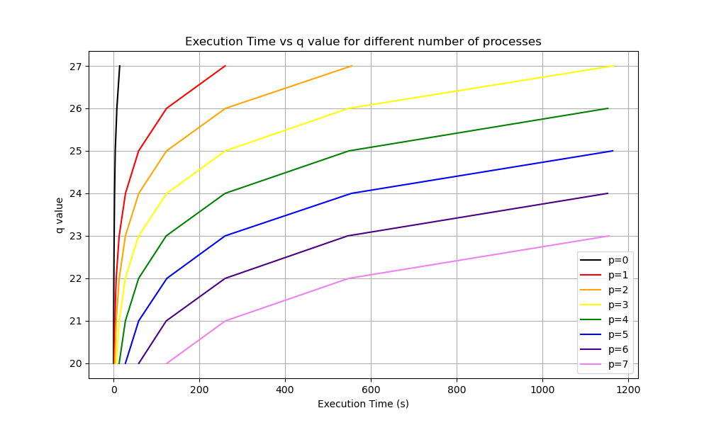

## Appendix
For more in-depth information about the project, please refer to the report.pdf document.

# Bitonic Sort using MPI
**Authors:** Ioannis Michalainas, Savvas Tzanetis

**Date:** December 2024

This project implements *distributed sorting* using the **Bitonic Sort** algorithm and the **Message Passing Interface (MPI)**. 
The primary objective is to sort a dataset of **N = 2<sup>q+p</sup>** numbers -where **2<sup>p</sup>** represents the total *processes* and **2<sup>q</sup>** the *numbers* assigned per process- utilizing inter-process communication. 
The implementation employs parallel processing to achieve efficient sorting, making it suitable for large-scale data sets.

## Installation

### Prerequisites
1. A `C` compiler
2. The `MPI` library

By running `mpirun --version` you can verify the installation. After installing this library you should clone this repository and compile the source code using the included Makefile:

### Execution

1. Clone this repository
```bash
git clone https://github.com/ioannisam/k-nn.git
```
2. Navigate to the correct directory
```bash
cd bitonic-sort
```
3. Compile the program using the included makefile
```bash
make
```

To run the executable you can either run the command `make run`, which executes the algorithm with **4** processes and a sequence of **16 random** numbers (4 numbers per process). In order to tweak the ammount of processes or total numbers to sort you should run the following command:

```bash
mpirun -np {np} ./bin/distributed {q} {p}
```
Where **np** is the number of processes (np = 2<sup>p</sup>), **2<sup>q</sup>** is the number of random integers per process and **2<sup>p</sup>** is also the number of processes.

For example, in order to run **4 processes** with **4 integers** per process you need to run:

```bash
mpirun -np 4 ./bin/distributed 2 2
```

## Performance
This program was executed on the **Aristotle Cluster** provided by the **Aristotle University of Thessaloniki**. 
We tested our program across a range of parameters: **p = [1:7]** and **q = [20:27]**, where the random array (to be sorted) was populated with integers in the range **1–999**. 
We then verified the correctness of the results using **qsort**.

| **Performance Table** | **Serial**            | **Distributed**      | **Quick Sort**     |
|-----------------------|-----------------------|----------------------|--------------------|
| **Time Complexity**   | O(nlog<sup>2</sup>(n))| O(log<sup>2</sup>(n))|  O(nlog(n))        |



## Appendix
For more in-depth information about the project, please refer to the `report.pdf` document.
